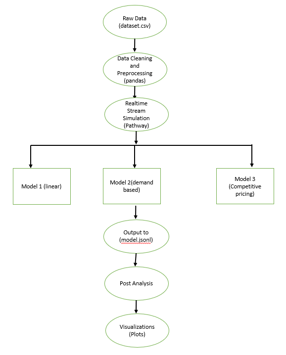

# Summer_Analytics_2025 Capstone Project
# Dynamic Pricing for Urban Parking Lots

**Problem Statement:** 
Urban parking spaces are a limited and highly demanded resource. Prices that remain static throughout the day can lead to inefficiencies — either overcrowding or underutilization. To improve utilization, dynamic pricing based on demand, competition, and real-time conditions is crucial.
This project simulates such a system for an intelligent, data-driven pricing engine for 14 parking spaces using real-time data streams, basic economic theory, and ML models built from scratch, using only numpy, pandas libraries.

**Objective:**
To build a dynamic pricing engine that:
Updates parking prices in real-time based on:
  - Occupancy
  - Queue length
  - Traffic congestion
  - Vehicle type
  - Special days
  - Competitor pricing
    
It Implements 3 pricing models from scratch.

Produces smooth and explainable price variations

Provides visual comparisons between pricing strategies

**Models Implemented:**

**Model 1: Linear Pricing Model**

Price increases linearly with occupancy rate.
Formula:
Price_{t+1} = Price_t + α × (Occupancy / Capacity)

**Model 2: Demand-Based Pricing Model**

Adjusts price using a demand function:
Formula:
Demand=α(Occupancy/Capacity)+β(Queue)−γ(Traffic)+δ(SpecialDay)+ε(VehicleTypeWeight)

Final Price:
Price=Base×(1+λ×NormalizedDemand)

**Model 3: Competitive Pricing Model**

Adds competitive logic based on geolocation:
Nearby lots cheaper → reduce or suggest rerouting

Nearby lots expensive → price can be raised moderately

# Project Structure
**File Name	Description:** 
- architecture_diagram.png
- dataset.csv	Original dataset (raw parking records)
- parking_stream.csv	Cleaned + timestamp-aligned data used in Pathway
- model1_prices.jsonl	Real-time pricing output from Model 1
- model2_prices.jsonl	Real-time pricing output from Model 2
- model3_prices.jsonl	Real-time pricing output from Model 3 (with competition logic)
- pricing_engine.ipynb	Main notebook with Pathway setup, pricing logic, and streaming output
- pricing_analysis.ipynb	Notebook for post-analysis and visualization of model comparisons

**Visualizations:**
Implemented using Matplotlib(bokeh wasn't working).

**Tech Stack:**
- pandas	Data cleaning, processing
- numpy	Math operations
- pathway	Real-time simulation
- matplotlib	Visualization
- Google Colab	Execution environment

**Execution Workflow:**

**Architecture Diagram**

Run pricing_engine.ipynb
- Stream prices using Pathway
- Outputs saved to jsonl files

Run pricing_analysis.ipynb
- Read all three models’ outputs
- Plot comparisons

**Project is split into 2 notebooks for clarity: streaming and analysis.**
**Only allowed libraries were used.**

